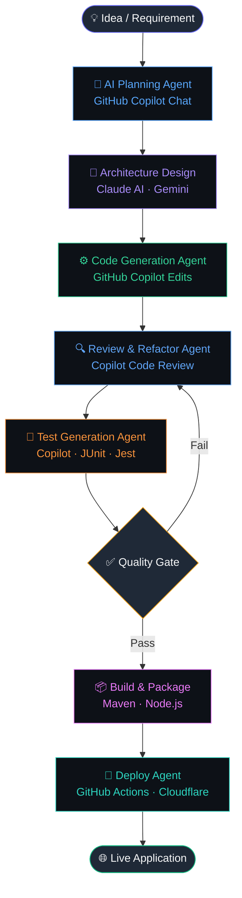

<div align="center">

<!-- Animated wave header -->


<!-- Typing animation -->
<a href="https://git.io/typing-svg">
  
</a>

<br/>

<!-- Profile badges -->
<a href="https://github.com/ShresthaSailesh">
  
</a>
<a href="https://github.com/ShresthaSailesh?tab=followers">
  
</a>

</div>

---

## 🤖 About Me

```yaml
name:      Sailesh Shrestha
location:  United States
education: MSIS — Master of Information Systems
role:      Software Engineer · AI Architect · Agentic Developer

identity:
  - Design and orchestrate multi-agent AI systems for real-world software delivery
  - Build AI-native full-stack applications where agents drive the dev lifecycle
  - Architect agentic pipelines: plan → generate → review → test → deploy
  - Leverage GitHub Copilot Agents, Claude AI, and Gemini as active collaborators

core_focus:
  - Agentic AI Architecture & Multi-Agent Orchestration
  - AI-Powered Software Design Patterns
  - Enterprise Java · Spring Boot · Microservices
  - Full-Stack Development with AI-augmented workflows

ask_me_about:
  - Agentic development with GitHub Copilot
  - Designing AI-driven SDLC pipelines
  - Java · Spring Boot · REST APIs
  - Deploying AI-native apps on Cloudflare
```

---

## 🧠 AI Architecture & Agentic Flow

> How I design and ship software — orchestrated by AI agents at every stage.



### Agent Roles in My Workflow

| Agent | Model / Tool | Responsibility |
|-------|-------------|----------------|
| 🧠 **Planning** | GitHub Copilot Chat | Break down requirements, propose architecture |
| 📐 **Design** | Claude AI · Gemini | System design, API contracts, data modeling |
| ⚙️ **Generation** | GitHub Copilot Edits | Implement features, boilerplate, patterns |
| 🔍 **Review** | Copilot Code Review | Catch bugs, enforce standards, suggest improvements |
| 🧪 **Testing** | Copilot · JUnit · Jest | Generate unit, integration, and edge-case tests |
| 📦 **Build** | Maven · Node.js | Compile, package, and validate artifacts |
| 🚀 **Deployment** | GitHub Actions · Cloudflare | CI/CD pipeline, automated rollout |

---

## ⚡ Currently Working On

> 🤖 _This section is **automatically updated** by GitHub Actions — powered by the GitHub API_

<!-- CURRENTLY_WORKING_ON_START -->
_No recent activity detected._
<!-- CURRENTLY_WORKING_ON_END -->

---

## 🔒 Private Projects Showcase

> 🔐 _Private repositories are fetched via GitHub Actions using a scoped Personal Access Token. Names and descriptions are shown — source code remains private._

<!-- PRIVATE_PROJECTS_START -->
_No private repositories found. Add a `GH_PAT` secret with `repo` scope to display private projects._
<!-- PRIVATE_PROJECTS_END -->

---

## 🛠️ Tech Stack

<div align="center">

### 💻 Languages


### 🚀 Frameworks & Runtimes


### 🤖 AI Agents & Tools


### 🔧 IDEs & Platforms


### 🗄️ Databases & Cloud


</div>

---

## 📊 GitHub Stats

<div align="center">


<br/>


<br/>


</div>

---

## 🏆 GitHub Trophies

<div align="center">
  
</div>

---

## 💼 Work Experience

<!-- LINKEDIN_EXPERIENCE_START -->
<table>
  <tr>
    <th>Role</th>
    <th>Company</th>
    <th>Duration</th>
    <th>Highlights</th>
  </tr>
  <tr>
    <td>🧑‍💻 <strong>Software Engineer</strong></td>
    <td><em>See LinkedIn</em></td>
    <td><em>See LinkedIn</em></td>
    <td>Full-stack development · Java · Spring Boot · REST APIs</td>
  </tr>
</table>

> 📌 _Full work history available on [LinkedIn](https://www.linkedin.com/in/sailesh-shrestha/)_
<!-- LINKEDIN_EXPERIENCE_END -->

---

## 🔗 Featured LinkedIn Projects

<!-- LINKEDIN_PROJECTS_START -->
> 📌 _Public projects and portfolio available on [LinkedIn](https://www.linkedin.com/in/sailesh-shrestha/)_
<!-- LINKEDIN_PROJECTS_END -->

---

## 🚀 Deployed Projects

> 🌐 _Four live applications built and deployed using **GitHub Copilot**, **Google Gemini**, **Claude AI**, and hosted on **Cloudflare** — developed with **IntelliJ IDEA** and **Visual Studio**._

<div align="center">

| &nbsp; | Project | Description | Status |
|:---:|---------|-------------|:------:|
| 💍 | **[Marriage Maal Hisaab](https://marriagemaalhisaab.com)** | Marriage expense tracker and financial management application | [](https://marriagemaalhisaab.com) |
| 🏆 | **[Phoenix Sports Zone](https://phoenixsportszone.com)** | Sports zone platform for managing and showcasing athletic activities | [](https://phoenixsportszone.com) |
| 🌻 | **[Little Sunflower Child Daycare](https://littlesunflowerchilddaycare.com)** | Child daycare management and information platform | [](https://littlesunflowerchilddaycare.com) |
| 🤖 | **[Shrestha.AI](https://shrestha.ai)** | Personal AI-powered portfolio and intelligent assistant platform | [](https://shrestha.ai) |

</div>

<details>
<summary>🛠️ <strong>Tools & Technologies Used</strong></summary>
<br/>

<div align="center">


</div>
</details>

---

## 📫 Let's Connect

<div align="center">

<a href="https://github.com/ShresthaSailesh">
  
</a>
<a href="https://www.linkedin.com/in/sailesh-shrestha/">
  
</a>

<br/><br/>

💬 _Open to collaboration, networking, and interesting conversations about software engineering!_

</div>

---

<div align="center">

<!-- LAST_UPDATED_START -->
_🤖 Auto-updated by GitHub Actions on **2026-05-15 01:54 UTC**_
<!-- LAST_UPDATED_END -->

<br/>


</div>
